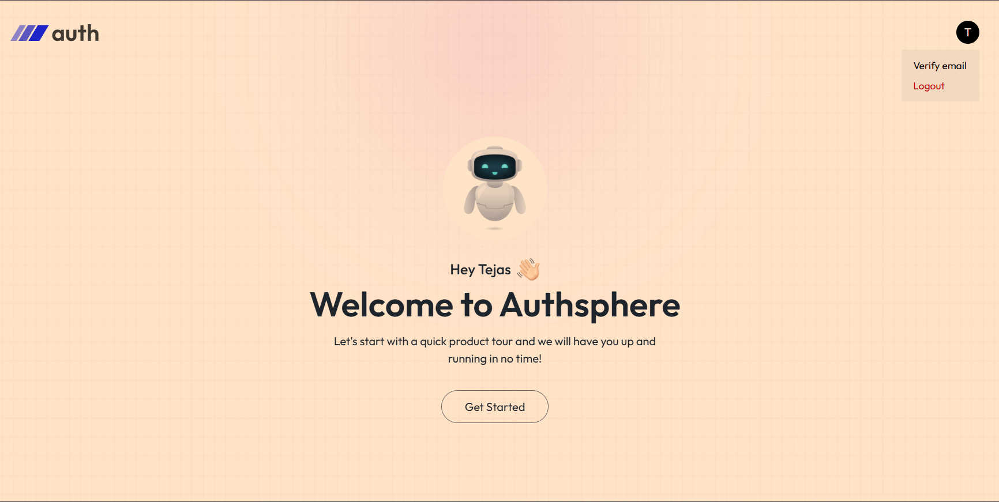
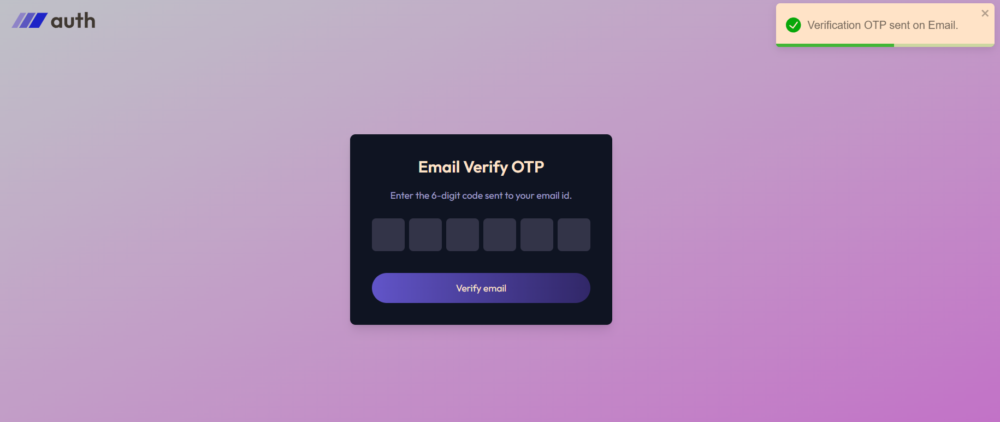

# <b>🔐 Authentify App</b>

A full-stack authentication system built with NodeJs +ExpressJs (Backend) and React (Frontend). It provides a secure and smooth user experience with JWT-based authentication, email verification, and password reset via OTP.

# <b>✨ Features</b>

# <u>👤 User</u>

✅ Register new account with email verification (OTP)
✅ Login with JWT Authentication
✅ Reset password via OTP sent to email
✅ Secure logout functionality
✅ Responsive design for all devices

# <u>⚙️ Security</u>

✅ JWT-based authentication (Authorization in future scope).
✅ OTP-based verification for email & password reset
✅ Password hashing with bcrypt

# <b>🏗️ Tech Stack</b>

# <u>🔹 Frontend</u>

⚛️ React 19
🎨 Tailwind CSS
🗂️ Context API (state management)
🔗 Axios (API calls)

# <u>🔹 Backend</u>

🟢 Node.js + Express
🗄️ MongoDB + Mongoose

# <b> 🔹 Images</b>

