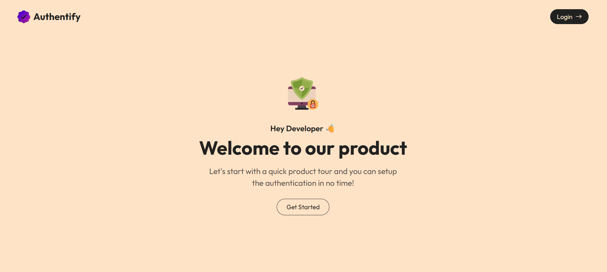
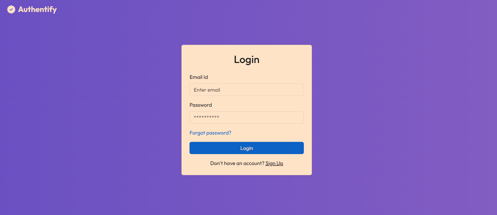
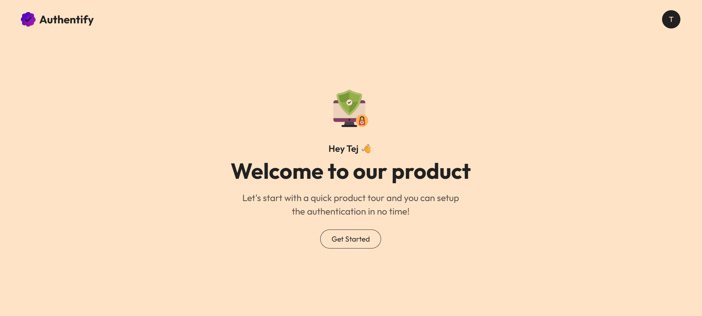

# <b>🔐 Authentify App</b>

A full-stack authentication system built with Spring Boot (Backend) and React (Frontend). It provides a secure and smooth user experience with JWT-based authentication, email verification, and password reset via OTP.

# <b>✨ Features</b>

# <u>👤 User</u>

✅ Register new account with email verification (OTP)
✅ Login with JWT Authentication
✅ Reset password via OTP sent to email
✅ Secure logout functionality
✅ Responsive design for all devices

# <u>⚙️ Security</u>

✅ Spring Security with JWT for authentication & authorization
✅ OTP-based verification for email & password reset
✅ Role-based access control (future-ready)

# <b>🏗️ Tech Stack</b>

# <u>🔹 Frontend</u>

⚛️ React 19
🎨 Bootstrap 5 (Responsive UI)
🔗 Axios (API calls)

# <u>🔹 Backend</u>

☕ Java 17
🌱 Spring Boot 3.x
🛡️ Spring Security + JWT
📧 JavaMailSender (Email OTP service)
🗄️ MySQL (Database)

# <b> 🔹 Images</b>

