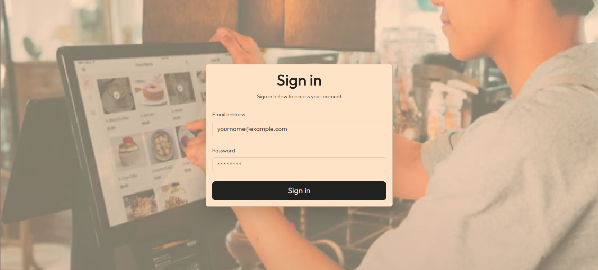
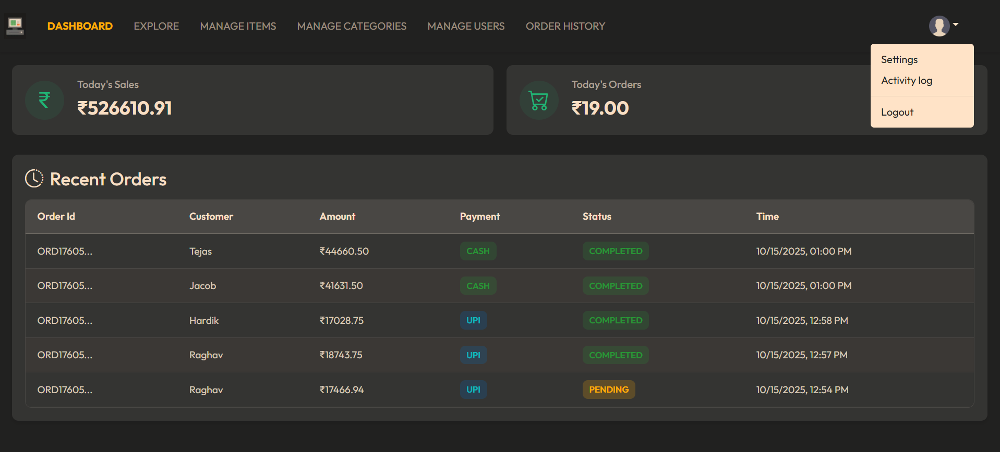
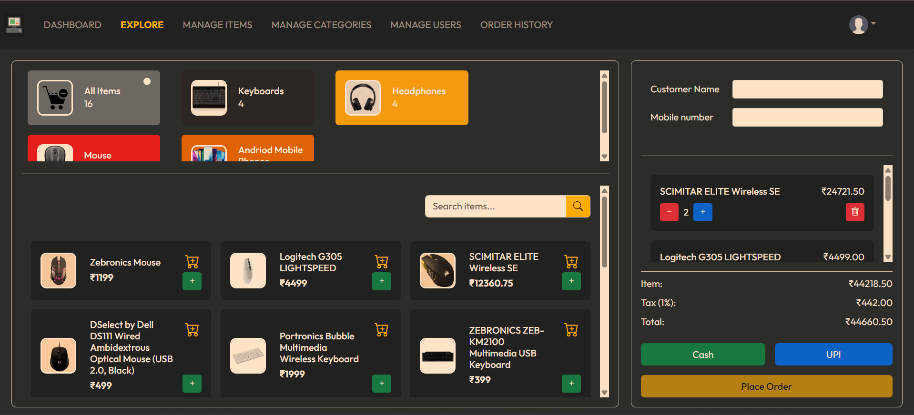
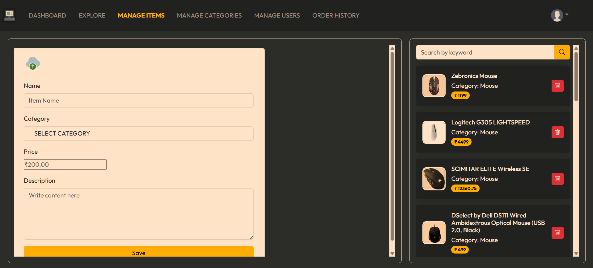
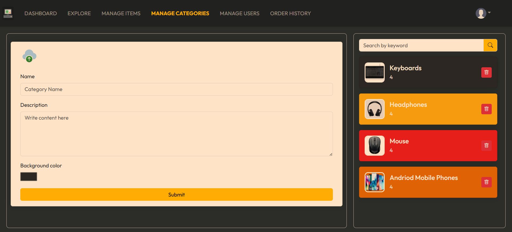
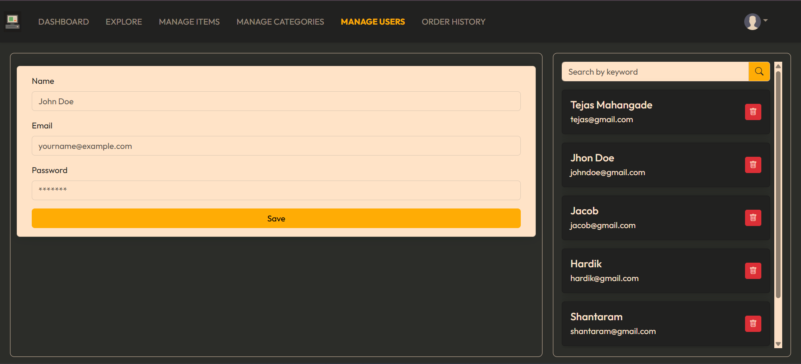
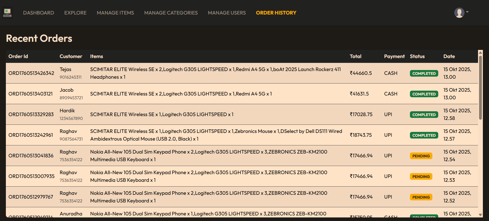
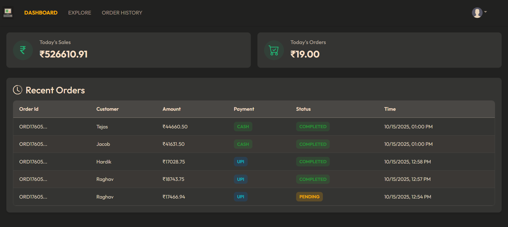
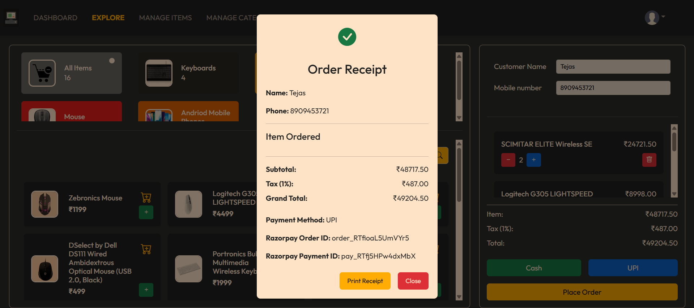
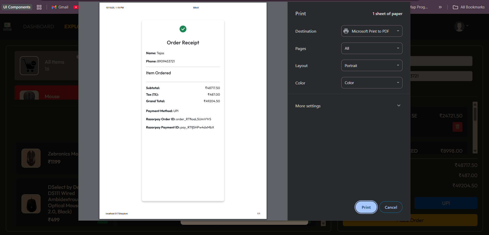

<b><u>💰 BilloX – Retail Billing System</u></b>

A full-stack retail billing and order management system built with Spring Boot (Backend) and React (Frontend). It provides an end-to-end billing solution with sales analytics, order placement, and secure authentication for Admin and Users.

<b><u>✨ Features</u></b>
<b>👑 Admin</b>

<u>✅ Dashboard</u>:
View today's sales, total orders, and recent orders with details like Order ID, Customer Name, Payment Mode, Time, Status, and Amount.

<u>✅ Explore</u>:
Perform CRUD operations for orders — including category selection, total price, tax, grand total, and payment via Cash or UPI (Razorpay).
Includes receipt generation, printing, and searching of categories by name or availability.

<u>✅ Manage Category</u>:
Add, update, delete, and search product categories with a simple and responsive category form.

<u>✅ Manage Items</u>:
Full CRUD operations on items, including adding, updating, deleting, and searching items.

<u>✅ Manage Users</u>:
Create, update, delete, and view user details with integrated search functionality.

<u>✅ Order History</u>:
Access detailed order records with Order ID, Customer Name, Contact Info, Item List (with quantities), Grand Total, Payment Mode, Status, and Date.

<b><u>👤 User</u></b>

✅ Access Dashboard, Explore, and Order History modules only.
✅ Secure Login and Logout functionality via Spring Security.
✅ Route-level Authorization with protected routes in React JS.

<b><u>🛡️ Authentication & Security</u></b>

✅ Spring Security for login/logout authentication.
✅ Role-based Authorization for Admin and User access control.
✅ Protected Frontend Routes to prevent unauthorized access.

<b><u>🏗️ Tech Stack</u></b>
<u>🔹 Frontend</u>

⚛️ React JS
🧭 React Router
🧠 Context API (State Management)
🎨 Bootstrap 5 (Responsive UI)
🔗 Axios (API Integration)

<u>🔹 Backend</u>

☕ Java 17
🌱 Spring Boot 3.x
📦 Spring Data JPA (ORM)
🛡️ Spring Security
💳 Razorpay (UPI Payment Integration)
🗄️ MySQL (Database)

⚙️ Project Setup (Run Locally)
🗄️ Backend Setup (Spring Boot)

# <b> 🔹 Images</b>

Clone the repository:

git clone https://github.com/your-username/BilloX.git

Navigate to the backend folder:

cd BilloX/backend

Configure your application.properties:

spring.datasource.url=jdbc:mysql://localhost:3306/billox_db
spring.datasource.username=root
spring.datasource.password=yourpassword
spring.jpa.hibernate.ddl-auto=update
razorpay.key_id=your_razorpay_key
razorpay.key_secret=your_razorpay_secret

Run the Spring Boot application:

mvn spring-boot:run

The backend will start on:
http://localhost:8080

💻 Frontend Setup (React)

Navigate to the frontend folder:

cd BilloX/frontend

Install dependencies:

npm install

Start the React app:

npm start

The frontend will start on:
http://localhost:3000

🧾 Additional Notes

Ensure MySQL is running locally and the billox_db database is created.

Update your Razorpay credentials in application.properties.

For receipt printing, use a connected printer or save as PDF from the print dialog.
