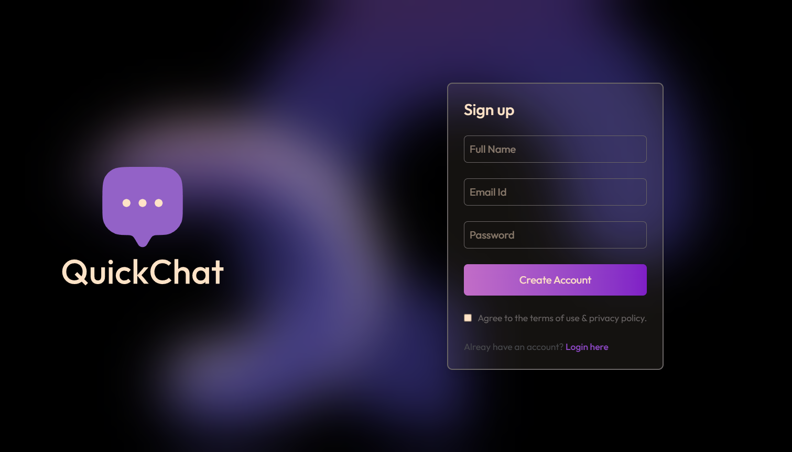
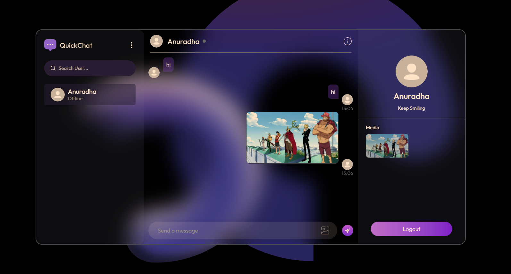
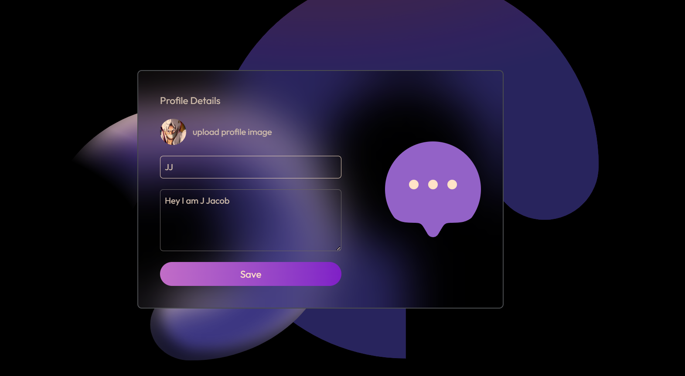
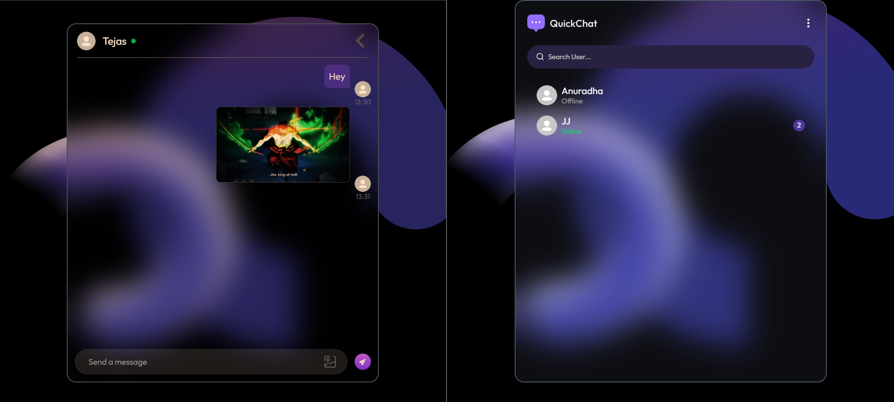

# <b>💬 QuickChat App</b>

A real-time chat application built with MERN stack providing instant messaging, profile customization, and smooth UI.

🔗 <b>**Live Demo:**</b>
[QuickChat App](https://quick-chat-sage-tau.vercel.app/)

# <b>✨ Features</b>

- ⚡ Real-time one-to-one messaging with Socket.io  
- 👀 Seen/unseen message indicators  
- 🖼️ Image sharing support  
- 👤 Profile management (avatar, name, bio)  
- 🔐 Secure authentication with JWT & bcrypt  
- 🟢 Online/offline user status 
- 📱 Responsive design (Tailwind CSS) 

# <u>⚙️ Security</u>

- ✅ JWT-based authentication & authorization  
- ✅ Password hashing with bcrypt  
- ✅ CORS protection enabled  

# <b>🏗️ Tech Stack</b>

# <u>🔹 Frontend</u>

- ⚛️ React 19  
- 🎨 Tailwind CSS  
- 🗂️ Context API (state management)  
- 🔗 Axios (API calls) 

# <u>🔹 Backend</u>

- 🟢 Node.js + Express  
- 🗄️ MongoDB + Mongoose  
- 📡 Socket.io (real-time messaging)  

# <b> 🔹 Images</b>

