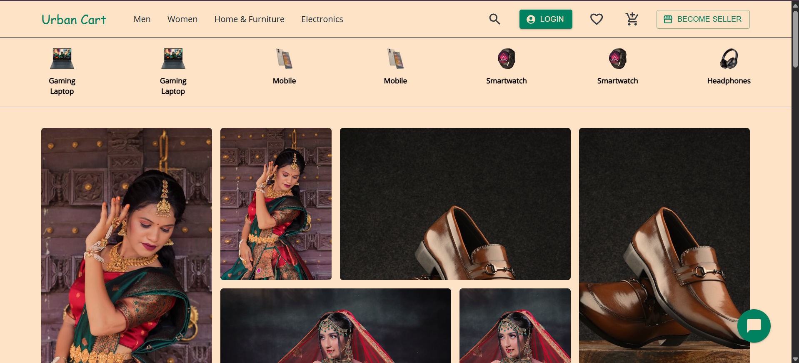
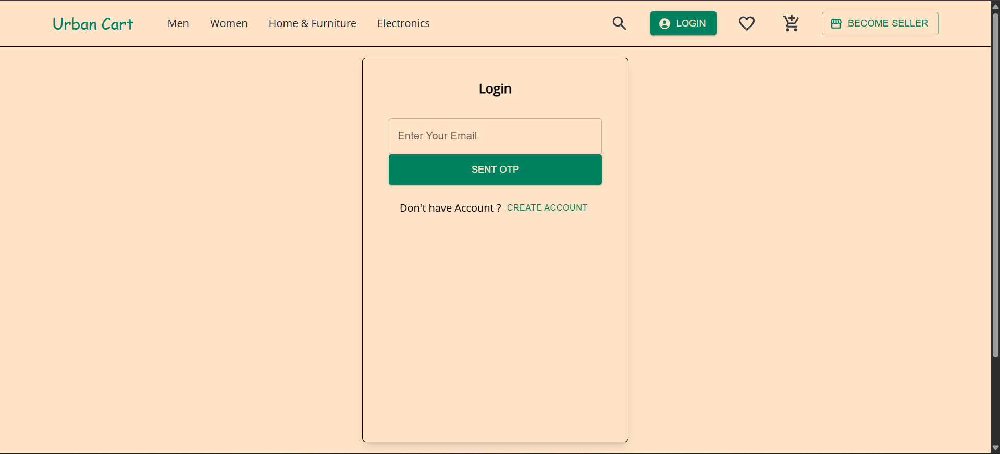
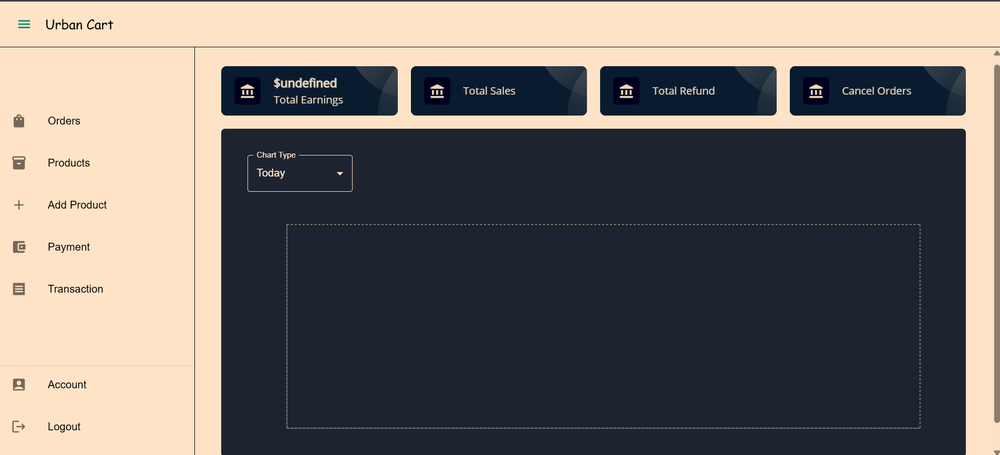

#<b>🛒 E-Commerce App</b>:
A full-stack E-Commerce web application built with Spring Boot (Backend) and React (Frontend).
It provides a smooth shopping experience with authentication, product management, cart system, order handling, and payment integration.

#<b>✨ Features</b>:
👤 <u>Customer</u>
✅ Browse products with filter, sort & pagination
✅ View detailed product info
✅ Cart management – add, update, or remove items
✅ Checkout with coupons, address management & payment (Razorpay 💳)
✅ View & cancel order history
✅ Manage account details
✅ Write reviews & ratings
✅ Maintain a wishlist

🛍️ <u>Seller</u>
✅ Dashboard with earnings graph & reports
✅ Track sales, earnings, refunds & cancellations
✅ Product management – add & manage inventory
✅ Order management – view & fulfill orders
✅ Monitor payments & transaction history
✅ Manage seller profile

⚙️ <u>Admin</u>
✅ Dashboard for platform overview
✅ Manage sellers (approval & suspension)
✅ Full coupon management (create, edit, delete)
✅ Homepage customization via admin panel
✅ Manage deals & promotional offers

#<b>🏗️ Tech Stack</b>
🔹 <u>Frontend</u>
⚛️ React 19
🎨 Tailwind CSS

🔹 <u>Backend</u>
☕ Java 17
🌱 Spring Boot 3.x
🛡️ Spring Security + JWT
🗄️ MySQL (Database)

💳 Razorpay API (Payments)

#<b>Images</b>:

